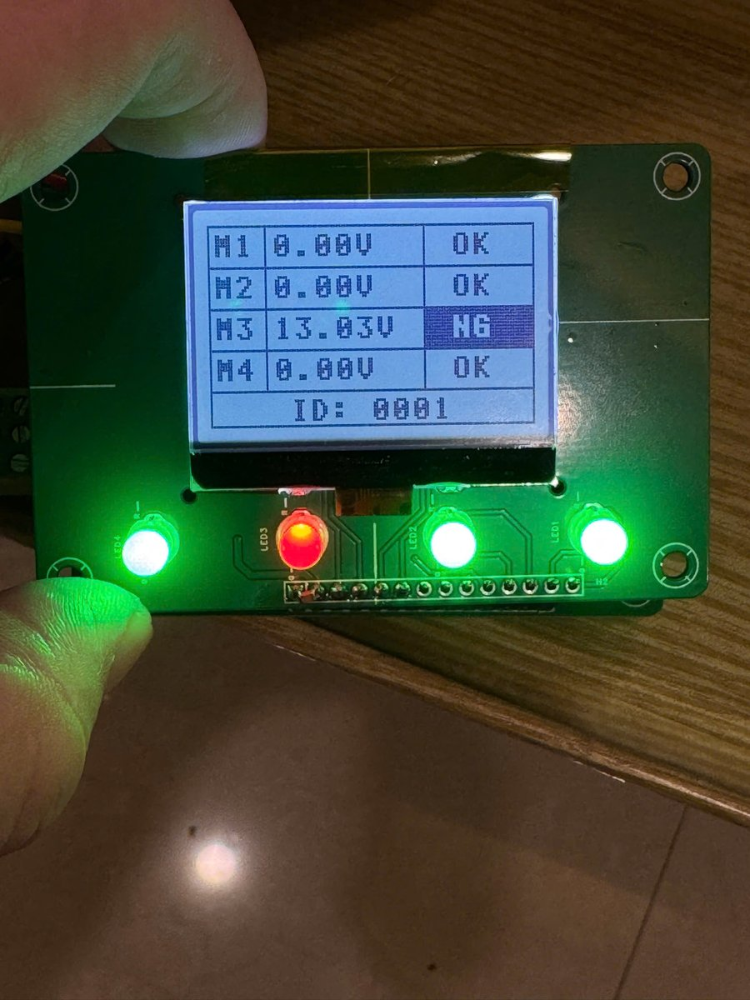
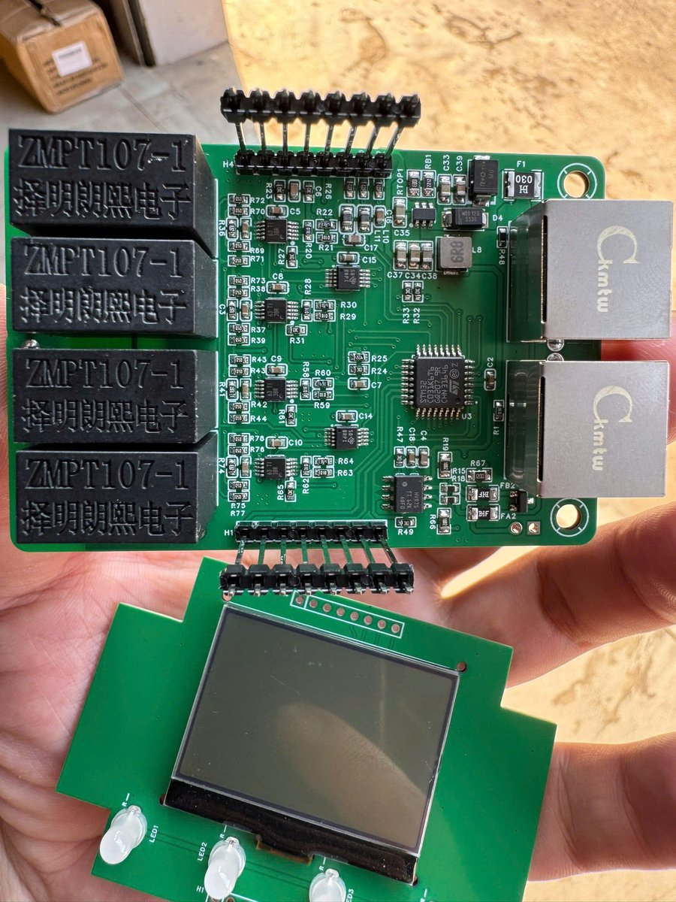
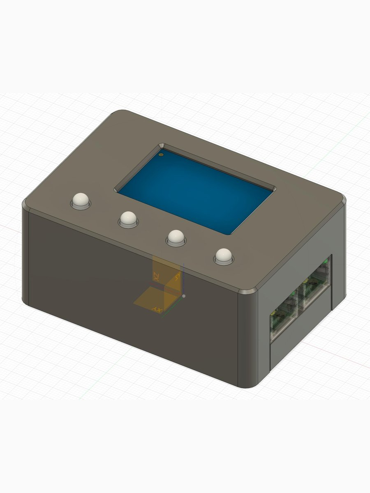

# FrameGuard — Open Leakage Voltage Monitor for Factory Machines

A small, low-cost device that watches for dangerous AC voltage leaking onto the metal frames of industrial machines — and warns people before they touch it.

An open project by **Anh Duong Electronics Viet Nam**.

Firmware for the STM32C031K6T6 (ARM Cortex-M0+), 1–4 monitoring channels, LCD + LED indication, RS-485 Modbus RTU output.

| Main board | PCB + LCD | 3D-printed enclosure |
|---|---|---|
|  |  |  |

---

## Why this project exists

Every day, millions of people work next to machines powered by mains electricity. When insulation ages, a cable is pinched, moisture gets in, or an earth connection quietly comes loose, the metal body of a machine can become live. Nothing looks different. The machine keeps running. The first person to notice may be the operator who touches it.

Electric shock in factories is preventable. Proper earthing, residual-current devices and regular inspection remain the foundation of electrical safety. But in many workplaces — especially small and medium factories — continuous monitoring of every machine frame is simply too expensive, so problems are found only during periodic checks, or after someone gets hurt.

This project started as a practical answer to that gap: **a simple box that sits on the production line, measures the voltage on each machine body continuously, and turns red the moment it becomes unsafe.** It also checks its own sensing wires, because a monitor with a broken wire that still shows "OK" is worse than no monitor at all.

I am sharing part of this work with the community because **worker safety should not depend on budget.** If this firmware helps one maintenance team find a leaking machine before a worker does, it has done its job.

### Who this is for

- Maintenance and electrical engineers who want an affordable early-warning layer on existing machines
- Makers and students learning embedded measurement, signal processing and industrial communication
- Small factories that cannot justify commercial monitoring systems for every workstation
- Anyone who wants to adapt, improve and share a safety tool

### What it does

- **Measures leakage voltage** on up to 4 machine frames, using true RMS so that distorted real-world signals (from inverters, filters, switching supplies) are not under-reported
- **Raises a clear alarm** per channel when voltage exceeds a configurable threshold — red LED and inverted "NG" on the LCD, visible from a distance
- **Detects broken or disconnected sensing wires** and reports them as a separate fault, so a silent failure is never mistaken for a safe reading
- **Reports to a central system** over RS-485 Modbus RTU, so a supervisor or SCADA/IoT gateway can watch many machines at once
- **Fails visibly**: watchdog-protected main loop, explicit INIT / ERR states, heartbeat counter on the bus

---

## ⚠️ Safety notice — please read

This is a **monitoring and early-warning aid**, not a protective device.

- It does **not** replace proper earthing, RCD/GFCI protection, insulation testing or the electrical safety regulations of your country.
- It has **not** been certified to any safety standard. Use it as an additional layer, never as the only one.
- Building, installing or connecting anything to mains-powered equipment must be done by **qualified personnel**, with the equipment isolated and following lock-out/tag-out procedures.
- The calibration table in this repository is a **placeholder**. Every build must be calibrated against a trusted true-RMS meter before it is relied on (see [Calibration](#calibration)).
- The software is provided "as is", without warranty of any kind (see [LICENSE](./LICENSE)).

If in doubt, treat every machine as live until proven otherwise.

---

## How it works (overview)

```
Machine frame ──► ZMPT107 voltage transformer ──► ADS1015 ADC (I2C) ──► STM32C031
                  (isolation + step-down)         (differential)        │
                                                                         ├─► True RMS + 50 Hz (Goertzel)
                                                                         ├─► Calibration table + per-channel K
                                                                         ├─► Threshold → OK / LEAK
                                                                         ├─► Wire check → WIRE_NG
                                                                         ▼
                                                    LCD 128×64 · LEDs · RS-485 Modbus RTU
```

- All filtering and RMS computation is done in software, so no precision analog filters are needed and the design adapts to 60 Hz grids by changing one constant.
- The device reports **true RMS** (fundamental + harmonics), matching what a true-RMS meter would show on a distorted leakage signal. The 50 Hz component is computed alongside it with the Goertzel algorithm.

See [docs/ac-measurement-algorithm.md](./docs/ac-measurement-algorithm.md) for a short explanation.

### Channel status

| Status | Meaning | LED |
|---|---|---|
| OK | Voltage below threshold, wire connected | Green |
| LEAK | Voltage above threshold | Red |
| WIRE_NG | Sensing wire broken or disconnected | Red, blinking |
| ERR | ADC / bus error | Off |
| INIT | Not yet confirmed | Off |
| DISABLED | Channel not in use (`qty=`) | Off |

---

## Hardware

- **MCU**: STM32C031K6T6 (ARM Cortex-M0+, LQFP32), 32 KB flash, 12 KB RAM, HSI 48 MHz ÷ 4 → 12 MHz
- **Sensing**: ZMPT107 voltage transformers + 2× ADS1015 12-bit ADC (I2C 0x48, 0x49), differential inputs
- **Display**: ST7567 128×64 LCD (SPI) + 4 bi-colour status LEDs
- **Field bus**: RS-485, Modbus RTU slave
- **Enclosure**: 3D-printable STL files in [`3d-shell/`](./3d-shell)
- **PCBA**: schematic, PCB layout and BOM are still under development and will be published as soon as the board has been verified to run reliably (see [Roadmap](#roadmap))

### Peripheral map

| Peripheral | Function | Pins | Notes |
|---|---|---|---|
| I2C1 | ADS1015 ADC | PA9 (SCL), PB9 (SDA) | 100 kHz |
| SPI1 | ST7567 LCD | PA1 (SCK), PA2 (MOSI), A0 = PA0, /RST = PA4, CS = GND | |
| ADC1, TIM1, GPIO | Wire check (`libwireprobe.a`) | PA5, PA7, PB0, PB1, PA8, PA15, PC6, PC15, PA6 | See `Core/Inc/wire_probe.h` |
| TIM3 | 1 µs timebase | — | Cortex-M0+ has no DWT cycle counter |
| USART1 | Modbus RTU slave | PC14 (TX), PB2 (RX), DE = PA12 | 9600 **8E1**, hardware DE, TX DMA |
| USART2 | Configuration commands (RX only) | PA3 (RX) | 115200 8N1, result shown on LCD |
| WWDG | Window watchdog | — | ~128–175 ms window |
| GPIO | 4 green/red LED pairs (active-low) | PB7/PB8, PB5/PB6, PB3/PB4, PA10/PA11 | |

---

## Getting started

### Requirements

- Arm GNU Toolchain (`arm-none-eabi-gcc`) — tested with GCC 13.2; on `PATH` or pass `make GCC_PATH=...`
- GNU Make
- SEGGER J-Link (or ST-Link / STM32CubeProgrammer)

### Build

```bash
make -j8
```

Output: `build/FrameGuard.elf` / `.hex` / `.bin` (~28.1 KB of the 30 KB application area).

- Default build is production (`DEBUG=0`).
- `make DEBUG=1` enables SEGGER RTT logging. It is built with link-time optimisation (`-flto`) so it fits the 30 KB budget (~26.8 KB).
- Run `make clean` when switching `DEBUG`.

### Flash (J-Link)

```bash
printf 'si 1\nspeed 3200\ndevice STM32C031K6\nconnect\nhalt\nloadfile build/FrameGuard.bin 0x08000000\nw4 0x40022000 0x00040600\nr\ng\nexit\n' | JLinkExe -nogui 1
```

The `w4 0x40022000 0x00040600` step clears `FLASH_ACR.EMPTY`. A blank STM32C0 latches this flag at power-up, and without clearing it every soft reset jumps into the system bootloader even though firmware is present. ST-Link / CubeProgrammer do not need this step.

### Debug logging (RTT)

Build with `make DEBUG=1`, then open JLinkRTTViewer (device `STM32C031K6`, SWD, 3200 kHz) or `JLinkRTTClient`. RTT `printf` has no `%f`; values are logged as integer millivolts.

---

## Configuration (USART2)

Send one line terminated by a newline at 115200 8N1. The result is shown on the LCD for 3 seconds and saved to flash.

| Command | Range | Purpose |
|---|---|---|
| `id=` | 1–9999 | Device ID (readable over Modbus) |
| `addr=` | 1–247 | Modbus slave address, effective immediately |
| `thr=` | 100–60000 mV | Leakage alarm threshold |
| `wire=` | 100–3000 | Wire-break detection threshold |
| `qty=` | 1–4 | Number of active channels |
| `v=` / `k1=`…`k4=` | 500–24000 mV | Per-channel calibration factor K |
| `config` | — | Show settings page on the LCD for 5 s |

## Modbus RTU

9600 bps, **8E1**, FC03 (read), FC04 (alias), FC06 (write registers 6 and 17). Standard poll: **FC03, address 1, quantity 17**.

Registers include per-channel voltage (0.01 V), per-channel status, alarm threshold, device ID, heartbeat and channel count. Full map: [docs/rs485-modbus-protocol.md](./docs/rs485-modbus-protocol.md).

## Calibration

The ZMPT107 response is not linear at low voltage, so the firmware converts readings through a multi-point table (`CAL[]` in `Core/Src/ads1015.c`) with piecewise-linear interpolation, then applies a per-channel factor K.

**The table shipped here is an illustrative linear placeholder.** To calibrate your build:

1. Build with `DEBUG=1` and connect RTT.
2. Apply known 50 Hz voltages across the range you care about, measured with a trusted true-RMS meter.
3. Record `vrms_total` for each level and replace the `CAL[]` entries (raw values must increase).
4. Rebuild with `DEBUG=0`, flash, then fine-tune each channel with `v=<mV>` while applying a known voltage.

---

## Repository layout

```
.
├── Core/
│   ├── Src/
│   │   ├── main.c            # Application, UART2 commands, Modbus register map
│   │   ├── ads1015.c         # ADS1015 driver, RMS + Goertzel, calibration table
│   │   ├── config_store.c    # Settings in the last flash page
│   │   ├── lcd_st7567.c      # ST7567 LCD driver
│   │   ├── modbus_rtu.c      # Portable Modbus RTU slave core (no HAL)
│   │   └── mb_port_usart1.c  # USART1 + DMA port for the Modbus core
│   ├── Inc/                  # Headers (wire_probe.h = wire-check API)
│   └── Lib/libwireprobe.a    # Wire-check implementation (prebuilt)
├── docs/                     # Technical notes
├── tools/                    # Python test scripts for Modbus and UART2
├── 3d-shell/                 # Enclosure STL files
└── images/
```

The wire-check implementation is distributed as a prebuilt library; everything else is open source.

## Documentation

- [AC measurement and Goertzel](./docs/ac-measurement-algorithm.md)
- [Modbus RTU protocol and register map](./docs/rs485-modbus-protocol.md)
- [System architecture](./docs/system-architecture.md)
- [ST7567 LCD notes](./docs/lcd-st7567-reference.md)
- [Test scripts](./tools/README.md)

## Development notes

- **CubeMX**: keep user code inside `/* USER CODE BEGIN/END */` blocks so regenerating from `FrameGuard.ioc` does not overwrite it.
- **Linker script**: `(READONLY)` was removed for GCC 10 compatibility; CubeMX adds it back on regeneration — remove it again or use GCC ≥ 11.
- **Watchdog**: the WWDG is always active; long operations must call `app_wwdg_kick()`.

---

## Roadmap

| Stage | Status |
|---|---|
| **Firmware** — measurement, alarms, wire check, Modbus RTU | ✅ Available in this repository |
| **3D-printed enclosure** | ✅ Available in [`3d-shell/`](./3d-shell) |
| **PCBA** — schematic, PCB layout, BOM | 🔧 In development — will be published as soon as the board has been tested and proven stable |
| **Community website** — a place to connect users, share installations, field reports and calibration data | 🗺️ Planned |
| **Real-time dashboard** — watch many machines and production lines live from one screen, with alarm history | 🗺️ Planned |

The goal is a complete, open safety kit: hardware anyone can build, firmware anyone can audit, and tools that let one person look after a whole factory floor.

---

## Contributing

Safety tools get better when more eyes look at them. Contributions are welcome, especially:

- Field reports: where you installed it, what you measured, what went wrong
- Calibration data and methods for other transformer types
- Translations of the documentation into other languages
- Hardware variants, enclosure improvements, 60 Hz validation
- Code review of the measurement and alarm logic

Please open an issue before large changes. When reporting a safety-related bug, describe the conditions clearly so others can reproduce and verify it.

## Authors

FrameGuard is developed and maintained by **Anh Duong Electronics Viet Nam**.

- **Lac Van Vien** — developer
- **My Nguyen** — developer

## License

The project source code is released under the [MIT License](./LICENSE), © 2026 Anh Duong Electronics Viet Nam.

Third-party components keep their original licenses:

- STM32C0xx HAL Driver (STMicroelectronics) — BSD-3-Clause, `Drivers/STM32C0xx_HAL_Driver/LICENSE.txt`
- CMSIS Device STM32C0xx (STMicroelectronics) — Apache-2.0, `Drivers/CMSIS/Device/ST/STM32C0xx/LICENSE.txt`
- CMSIS Core (Arm) — Apache-2.0, `Drivers/CMSIS/LICENSE.txt`
- SEGGER RTT — SEGGER BSD-style license, `Middlewares/Third_Party/SEGGER_RTT/LICENSE.md`

Project skeleton generated with STM32CubeMX 6.18.1 (STM32Cube FW_C0 V1.4.1).

---

*Built for the people on the factory floor. Stay safe.*
